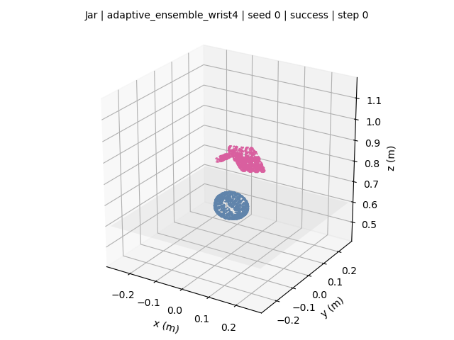
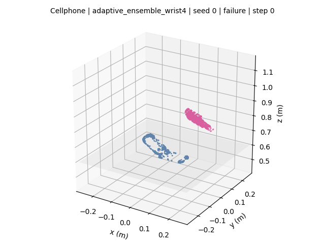
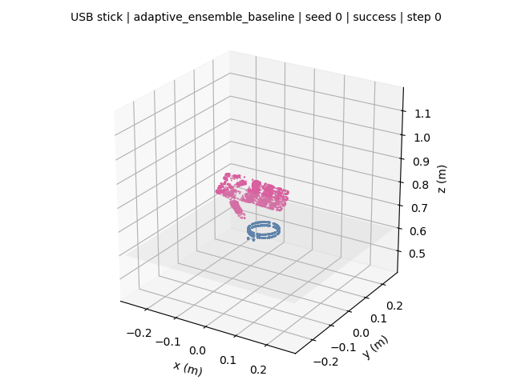
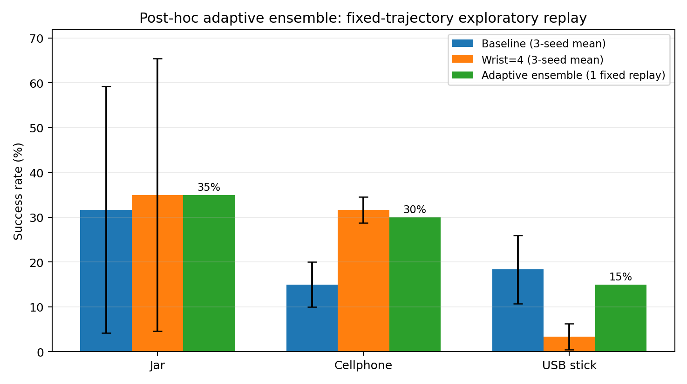
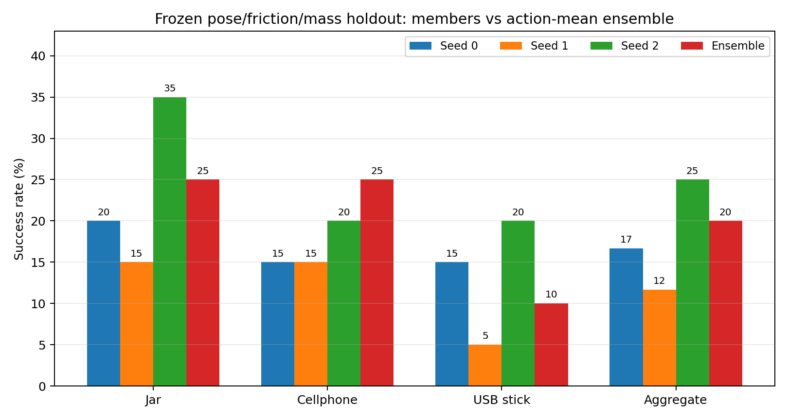
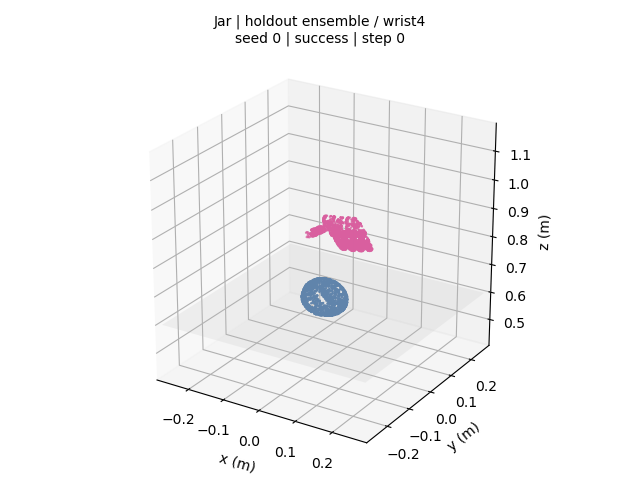
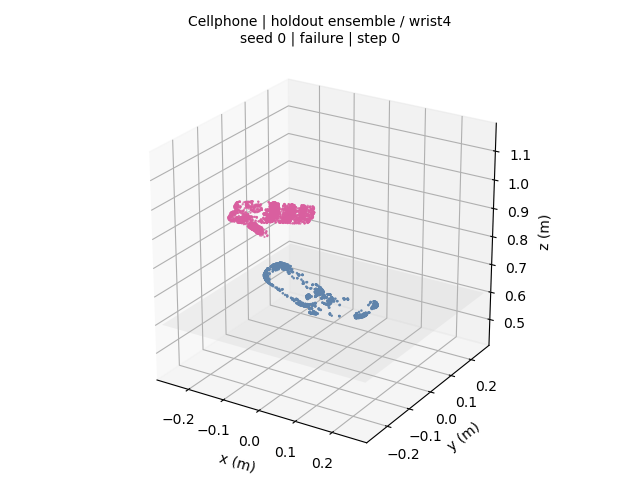
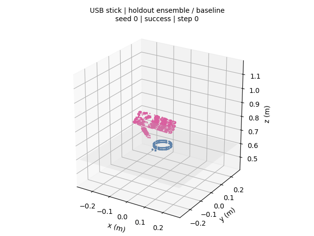

# GraspM3 / DexRep 三物体灵巧手抓取实验

## 📦 不知道从哪里看？点这里

**[打开“最终交付”中文文件夹](最终交付/README.md)**

里面只有按编号排列的最终报告、两张结果图、三个 GIF、两张结果表和复现配置。一般查看或提交给老师时，不需要进入其他英文目录。

后续独立性能优化没有改动上述最终交付；结果单独放在 **[“后续优化实验”中文文件夹](后续优化实验/姿态分层困难轨迹重采样/README.md)**。该轮姿态困难重采样是负结果，未替换最终策略。

本仓库给出在 **NVIDIA GeForce RTX 5070 Ti（`sm_120`）** 上完成 GraspM3 三物体公平行为克隆实验的代码、逐轨迹数据、曲线、真实物理回放和两页中文报告。

最终策略是仅把 wrist loss 权重从 2 调到 4 的 `wrist4`：三物体、三 seed、每物体 20 条轨迹合计 **42/180（23.33%）**；公平 baseline 为 **39/180（21.67%）**。前期三物体联合模型的 11/60（18.33%）仅作参考，不参与公平消融。

> 仓库不包含 GraspM3 dataset、meshdata、Isaac Gym、checkpoint 或论文 PDF；这些内容须按各自许可单独获取。

## 一眼看结果

| Jar 成功回放 | Cellphone 失败回放 |
|---|---|
|  |  |

GIF 由真实 Isaac Gym rollout 的手部 28 维状态、物体 7 维位姿和官方几何模型重建，不是示意动画。所有案例使用相同相机、坐标范围、帧率和颜色，并同时提供 MP4、四帧 PNG 与 metrics JSON。

| 物体 | Baseline：wrist=2 | 改进：wrist=4 |
|---|---:|---:|
| Jar | 19/60，31.67% ± 27.54% | 21/60，35.00% ± 30.41% |
| Cellphone | 9/60，15.00% ± 5.00% | 19/60，31.67% ± 2.89% |
| USB stick | 11/60，18.33% ± 7.64% | 2/60，3.33% ± 2.89% |
| **Aggregate** | **39/180，21.67%** | **42/180，23.33%** |

误差为三个训练 seed 的成功率样本标准差。wrist=4 提升了 aggregate 并明显改善 Cellphone，但对 USB stick 产生负迁移；因此结论是“整体小幅正向、对象间不均衡”，不是全面优于 baseline。


## 部署侧稳定化优化（探索性）

公平实验完成后，又冻结训练结果做了一次有边界的部署优化：Jar、Cellphone 路由到 `wrist4`，USB stick 路由到 baseline，并对每个物体的 seed 0/1/2 best checkpoint 输出的 28 维确定性动作取均值。

| Jar 集成成功 | Cellphone 集成失败 | USB stick 集成成功 |
|---|---|---|
|  |  |  |

固定 20 条轨迹复测得到 Jar 7/20、Cellphone 6/20、USB stick 3/20，合计 **16/60（26.67%）**，normalized lift 为 0.2820。单模型 CPU 推理平均 0.91 ms，三模型集成平均 2.46 ms，仍低于 60 Hz 的 16.7 ms 控制周期。



该测试复用了原固定轨迹，路由也是查看公平实验后才确定，因此它是**事后探索性部署复测**，不是独立测试集上的公平优越性结论。它证明的主要是稳定性：Jar seed 0 单模型为 0/20，而三 seed 集成为 7/20；它没有证明平均性能上限提高。详细数据、限制和下一步见 [自适应集成优化补充](experiment-final/自适应集成优化补充.md)。

## 独立扰动 Holdout

为验证上述稳定性是否能离开原固定轨迹成立，又在所有评估开始前冻结了一份独立 manifest。20 条逐轨迹扰动采用 Latin-hypercube 生成：对象平移 ±8 mm、绕竖直轴旋转 ±8°、摩擦 0.8–1.2、质量 0.16–0.24 kg。所有成员和集成严格复用同一扰动，manifest SHA256 为 `8cec9bee7170c47782b8d6e19662f5698840b9958ed06449350c89fc788c020d`。

| 物体 | Seed 0 | Seed 1 | Seed 2 | 集成 | 成员均值 |
|---|---:|---:|---:|---:|---:|
| Jar | 4/20 | 3/20 | 7/20 | 5/20 | 23.33% |
| Cellphone | 3/20 | 3/20 | 4/20 | 5/20 | 16.67% |
| USB stick | 3/20 | 1/20 | 4/20 | 2/20 | 13.33% |
| **Aggregate** | **10/60** | **7/60** | **15/60** | **12/60（20%）** | **32/180（17.78%）** |



集成相对成员逐样本均值提高 2.22 个百分点，但 cluster bootstrap 95% 区间为 **[-3.33, 8.33] 个百分点**，包含 0。因此独立 holdout 支持“降低最坏 seed 风险”，不支持“统计显著提升成功率”或“超过最佳成员”。完整配对结果和真实回放见 [独立扰动 Holdout 补充](experiment-final/独立扰动Holdout补充.md)。

| Jar holdout 成功 | Cellphone holdout 失败 | USB holdout 成功 |
|---|---|---|
|  |  |  |

## 公平实验协议

- 对象：Jar、Cellphone、USB stick 分别训练单物体策略；
- 划分：按完整 sequence 固定 80/20，split seed=0；
- 训练 seed：0、1、2；batch size=256；learning rate=`2e-4`；
- 最多 200 epoch，validation patience=30，以最低 validation loss 选择 checkpoint；
- milestone：1、5、10、25、50、100、best；
- baseline 与 wrist4 共用数据、split hash、网络、初始化规则和训练预算；
- 每个 best 对每个物体回放固定 20 条 raw trajectory。

三个对象的精确 split hash 和 sequence 索引见 [`split_manifest.json`](experiment-final/configs/split_manifest.json)，完整配置见 [`fair_experiment.yaml`](experiment-final/configs/fair_experiment.yaml)。18 个 best checkpoint 均已在官方 PyTorch 1.12.1 环境中 `strict=True` 加载并通过 28 维前向检查。

## 曲线与可追溯数据

| BC loss | Success 随 epoch |
|---|---|
|  |  |


逐轨迹指标包括：

```text
success
success_step
max_lift_m
final_lift_m
normalized_lift_score = clip(max_lift_m / 0.30, 0, 1)
```

该连续指标的完整名称是 **checkpoint evaluation normalized lift score**，不是 BC training reward。每个成功率数字均可追溯到：

- [18 个 best rollout 汇总](experiment-final/results/best_rollout_summary.csv)
- [36 个 milestone rollout 汇总](experiment-final/results/milestone_rollout_summary.csv)
- [1,080 条逐轨迹指标](experiment-final/results/trajectory_metrics.csv)
- [聚合均值与标准差](experiment-final/results/aggregate_summary.csv)
- [机器可读完整摘要](experiment-final/results/summary.json)

完整结论与边界见 [中文实验报告（Markdown）](experiment-final/灵巧手抓取实验报告.md) 或 [两页 PDF](experiment-final/灵巧手抓取实验报告.pdf)。

## 为什么旧环境不能把策略放到 RTX 5070 Ti 上

RTX 5070 Ti 的 compute capability 是 `sm_120`，而官方环境固定的 PyTorch 1.12.1+cu113 wheel 只包含至 `sm_86` 的 CUDA kernel。旧 PyTorch 对真实 CUDA tensor 运算会提示架构不兼容；直接升级又会破坏 Isaac Gym、`gymtorch` 与旧 ABI 依赖。

这不等于 GPU 完全不可用。本项目采用分层执行：

```text
现代环境：PyTorch 2.7.1+cu128 + RTX 5070 Ti → GPU 离线训练
                                      ↓ 旧格式 checkpoint
官方环境：PyTorch 1.12.1 CPU policy + GPU PhysX + CPU tensor pipeline
```

因此物理引擎仍显示 `Physics Device: cuda:0`，但策略推理使用 CPU。现代环境生成的 checkpoint 可被旧环境严格加载。

## 复现

准备以下受许可内容：

- NVIDIA Isaac Gym Preview 4；
- GraspM3 dataset 与 meshdata；
- [DexGraspMotionChallenge2025](https://github.com/DexGraspMotionChallenge/DexGraspMotionChallenge2025)，基于提交 `f41dc7d1d6f7871b50d8f31f1e89718591464458`。

应用兼容补丁：

```bash
git -C /path/to/DexGraspMotionChallenge2025 apply \
  /path/to/graspm3-dexrep-rtx50/patches/dexgrasp-rtx50-compat.patch
```

设置路径（也可采用脚本中的相邻目录默认值），准备好三个对象的 DexRep cache 后运行：

```bash
export DEXGRASP_REPO_DIR=/path/to/DexGraspMotionChallenge2025
export ISAACGYM_DIR=/path/to/isaacgym
export GRASPM3_DIR=/path/to/GraspM3
export FINAL_EVAL_JOBS=2

bash scripts/run_final_closeout.sh
```

单次公共接口：

- 训练：`train_bc_modern_torch.py --object-code ... --seed ... --wrist-weight ... --milestone-epochs ...`；
- 评估：`run_final_eval.sh` 支持 `--checkpoint` 或逗号分隔的 `--checkpoints`，统一输出 `rollout_metrics.json`；
- 自适应集成：`run_adaptive_ensemble_eval.sh` 按物体路由并加载三个 seed 的 best checkpoint；
- 独立扰动：先用 `generate_holdout_manifest.py` 冻结 manifest，再用 `run_perturbation_holdout.sh` 做成员与集成的配对回放；
- 渲染：`render_rollout_states.py --input ... --metrics ... --output-dir ...`，输出 GIF、MP4、四帧和 contact sheet。

## 仓库结构

```text
experiment-final/   # 最终报告、曲线、回放和 CSV/JSON/YAML
scripts/            # 训练、评估、渲染、汇总、报告与验收脚本
patches/            # 官方项目兼容与 evaluator 指标补丁
docker/             # 现代 PyTorch/CUDA 训练镜像
data/、docs/        # 前期 11/60 参考实验与 GraspM3 查看说明
```

## 结论边界

实验只覆盖固定三物体和固定 raw trajectory，不能外推到未见对象或真实机器人。下一步应同时诊断 Cellphone 的方向敏感 wrist 泛化和 USB 对 wrist 加权的负迁移，并在冻结协议后扩大独立测试对象；本阶段不继续无边界调参。

## 致谢与许可

实验基于 GraspM3、DexRep、DexGraspMotionChallenge2025 与 NVIDIA Isaac Gym。请遵守各上游项目、数据集和 NVIDIA 软件许可。仓库适配代码使用 [MIT License](LICENSE)。
