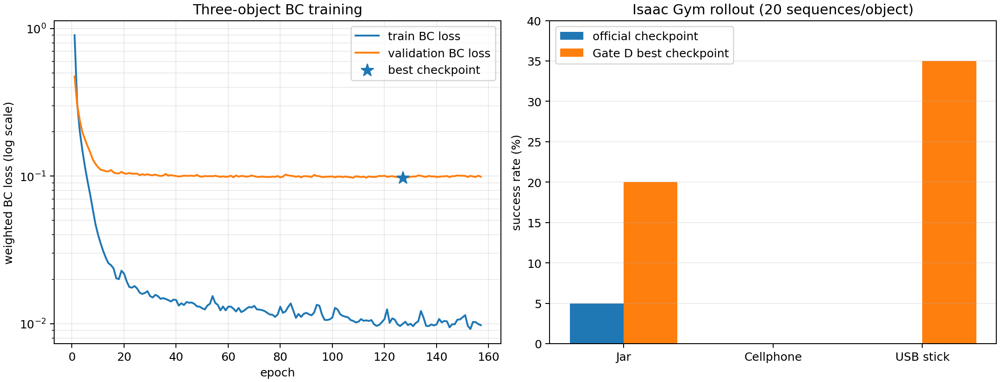
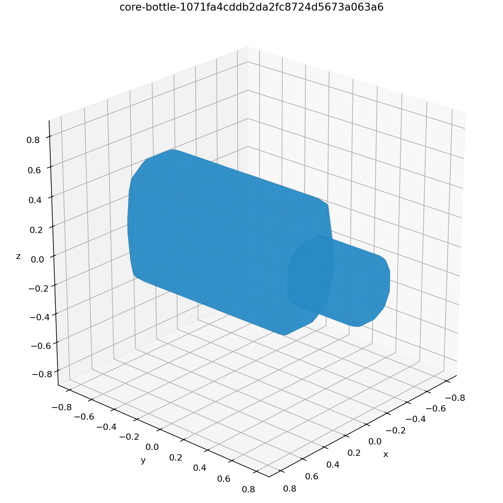
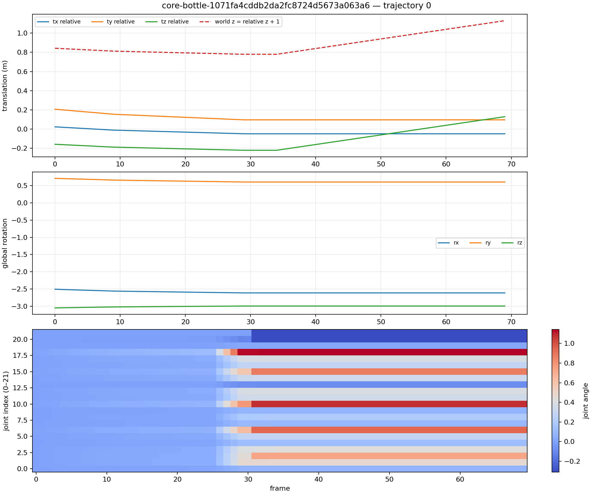

# GraspM3 / DexRep 在 RTX 50 系显卡上的训练与评估

本仓库记录了在 **NVIDIA GeForce RTX 5070 Ti（`sm_120`）** 上接入 GraspM3、运行 Isaac Gym Preview 4、训练 DexRep 行为克隆策略并完成三物体物理评估的完整结果。

项目解决的核心兼容问题是：官方环境固定为 PyTorch 1.12.1 + CUDA 11.3，无法在 Blackwell `sm_120` 上执行 PyTorch CUDA kernel；因此采用“旧环境负责 Isaac Gym / GPU PhysX，现代环境负责离线 GPU 训练”的分离架构。

> 本仓库不包含 GraspM3 原始数据、meshdata、Isaac Gym、NVIDIA 软件或训练 checkpoint。相关内容需要按照各自许可协议单独申请或下载。

## 一眼看结果



在三个参与训练的对象上，每个对象回放 20 条轨迹：

| 对象 | 几何特点 | 官方 checkpoint | 本项目 checkpoint |
|---|---|---:|---:|
| Jar | 近似规则、包络空间较大 | 1/20，5% | 4/20，20% |
| Cellphone | 扁平、方向敏感 | 0/20，0% | 0/20，0% |
| USB stick | 细长、小接触区域 | 0/20，0% | 7/20，35% |
| **合计** | — | **1/60，1.67%** | **11/60，18.33%** |

这里的结果是对已参与训练对象的 **in-distribution** 评估，不代表未见对象泛化能力。

## GraspM3 数据能看到什么

下面是仓库脚本从一条官方 GraspM3 记录导出的 mesh 和 28 维轨迹预览。

| 物体 mesh | 轨迹通道 |
|---|---|
|  |  |

每条轨迹为 `(T, 28)`：

- 前 3 维：灵巧手全局平移；
- 接着 3 维：灵巧手全局旋转；
- 后 22 维：Shadow Hand 关节角。

可使用 [`scripts/inspect_graspm3.py`](scripts/inspect_graspm3.py) 为自己的对象生成 PNG、CSV 和 JSON：

```bash
python scripts/inspect_graspm3.py OBJECT_ID \
  --dataset-root /path/to/GraspM3/dataset \
  --mesh-root /path/to/GraspM3/meshdata \
  --output-dir previews
```

只应对可信的官方 `.npy` 文件使用 `allow_pickle=True`。

## 实验数据

完整 GraspM3 审计结果：

| 项目 | 数量 |
|---|---:|
| `.npy` 文件 | 5,048 |
| 有效文件 | 5,048 |
| 抓取序列总数 | 160,495 |
| 固定帧数 | 70 |
| 匹配 mesh / `decomposed.obj` / `coacd.urdf` | 5,048 |

三物体经过 GPU PhysX replay 后得到 53 条可缓存轨迹：

| 对象 | raw 轨迹 | 通过 replay | train/validation |
|---|---:|---:|---:|
| Jar | 20 | 20 | 16 / 4 |
| Cellphone | 20 | 13 | 10 / 3 |
| USB stick | 20 | 20 | 16 / 4 |

训练采用按对象、按完整 sequence 的固定 seed 80/20 切分，避免相邻帧跨越训练集与验证集。

机器可读结果：

- [逐 epoch 训练曲线 CSV](data/metrics.csv)
- [完整训练指标 JSON](data/metrics.json)
- [逐物体误差 JSON](data/per_object_metrics.json)
- [Isaac Gym 回放结果 YAML](data/rollout_results.yaml)
- [Gate D 详细实验报告](docs/GATE_D_RESULT.md)

## GPU 兼容架构

```text
GraspM3 raw trajectory + meshdata
                │
                ▼
旧容器：Python 3.8 / PyTorch 1.12 / CUDA 11.3
CPU policy 与 DexRep tensor + GPU PhysX + CPU tensor pipeline
                │
                ▼
缓存 DexRep observations/actions
                │
                ▼
现代容器：PyTorch 2.7.1+cu128 / RTX 5070 Ti
离线训练并保存旧格式兼容 checkpoint
                │
                ▼
旧容器严格加载 checkpoint → GPU PhysX 回放
```

### 为什么官方 PyTorch 不能直接使用这张 GPU

- RTX 5070 Ti 的 compute capability 是 12.0，即 `sm_120`；
- 官方 PyTorch 1.12.1+cu113 wheel 只包含到 `sm_86`；
- 真实 CUDA tensor 运算会报 `no kernel image is available for execution on the device`；
- CUDA 11.3 早于 Blackwell，不能通过简单重编译旧扩展得到 `compute_120` 支持；
- 直接替换 PyTorch 会改变 Isaac Gym、`gymtorch` 和第三方扩展所依赖的旧 ABI。

GPU PhysX 与 PyTorch CUDA kernel 是不同执行路径，因此旧环境仍可显示：

```text
+++ Using GPU PhysX
Physics Device: cuda:0
GPU Pipeline: disabled
RL device: cpu
```

## 训练结果

```text
PyTorch               2.7.1+cu128
GPU                   RTX 5070 Ti, sm_120
batch size            256
learning rate         2e-4
requested epochs      200
early-stop patience   30
completed epochs      157
best epoch            127
best validation loss  0.097382
GPU training time     4.514 s
```

Cellphone 的 validation BC loss 为 0.2133，明显高于 jar 的 0.0415 和 USB stick 的 0.0663；其 wrist MSE 也最高。这说明当前主要瓶颈是 cellphone 成功轨迹不足以及跨姿态 wrist 控制泛化，而不是继续增加 epoch。

## 仓库结构

```text
.
├── assets/       # README 直接展示的 PNG/SVG
├── data/         # CSV、JSON、YAML 实验结果
├── docker/       # PyTorch 2.7.1 + CUDA 12.8 镜像定义
├── docs/         # 中文详细报告和数据查看说明
├── patches/      # 官方项目 RTX 50 系兼容补丁
└── scripts/      # 数据查看、DexRep 缓存、训练、分析与绘图脚本
```

## 复现

### 1. 获取受许可的软件和数据

请自行阅读并接受相应许可：

- NVIDIA Isaac Gym Preview 4；
- GraspM3 dataset 与 meshdata；
- [DexGraspMotionChallenge2025 官方代码](https://github.com/DexGraspMotionChallenge/DexGraspMotionChallenge2025)。

本实验基于官方提交：

```text
f41dc7d1d6f7871b50d8f31f1e89718591464458
```

### 2. 应用兼容补丁

```bash
git clone https://github.com/DexGraspMotionChallenge/DexGraspMotionChallenge2025.git
cd DexGraspMotionChallenge2025
git checkout f41dc7d1d6f7871b50d8f31f1e89718591464458
git apply ../graspm3-dexrep-rtx50/patches/dexgrasp-rtx50-compat.patch
```

### 3. 构建现代训练镜像

从本仓库根目录执行：

```bash
docker build \
  -f docker/Dockerfile.pytorch-smoke \
  -t graspm3-pytorch:2.7.1-cu128 .
```

### 4. 核心脚本

- `cache_selected_dexrep.py`：在旧 Isaac Gym 环境中将指定 raw trajectory 转为 DexRep 缓存；
- `train_bc_modern_torch.py`：在现代 CUDA 环境中训练与官方模型键名兼容的 BC MLP；
- `analyze_gate_d_checkpoint.py`：输出逐物体 wrist/orientation/finger/MAE 误差；
- `plot_gate_d_results.py`：生成本 README 中的训练曲线和成功率图；
- `pytorch_smoke.py`：验证 `sm_120` 上的真实 CUDA 矩阵运算。

## 限制与下一步

- 当前训练数据只有 53 条通过物理 replay 的轨迹；
- 结果是已训练对象上的评估，不是 unseen-object benchmark；
- Cellphone 仍为 0%，下一步应增加同类扁平物体数据并采用对象均衡采样；
- 若扩充数据后 wrist validation error 仍高，再考虑 GRU/TCN 或动作平滑正则；
- TorchSDF 的 signed-distance 训练操作尚未移植到该兼容路线。

## 致谢与许可

实验基于 GraspM3、DexRep、DexGraspMotionChallenge2025 与 NVIDIA Isaac Gym。请引用和遵守各上游项目、数据集及 NVIDIA 软件的许可要求。

仓库中的适配代码使用 [MIT License](LICENSE)。图片和表格为本地实验产生的派生结果。
