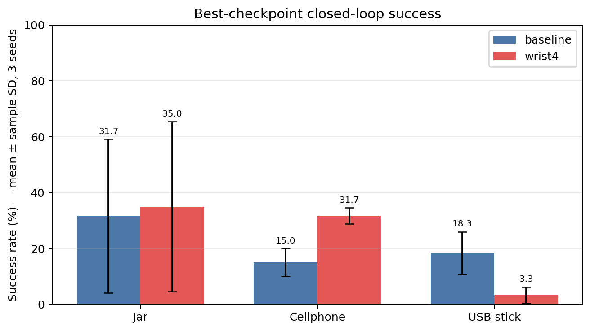
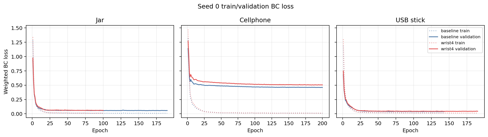
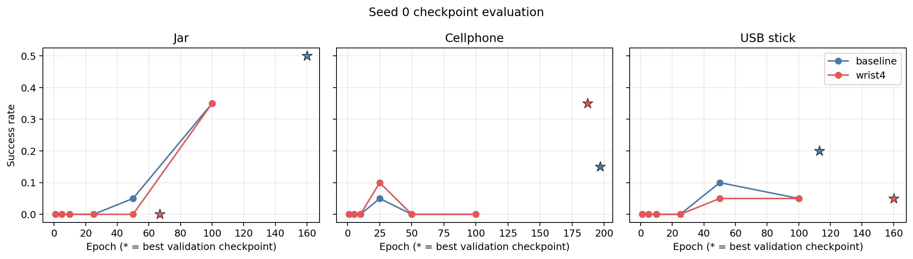
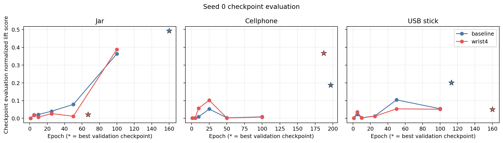
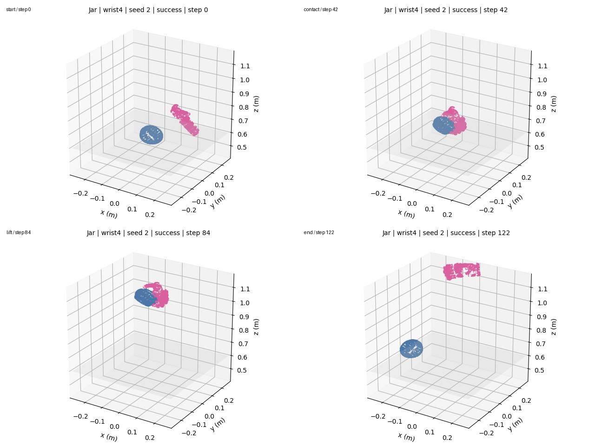
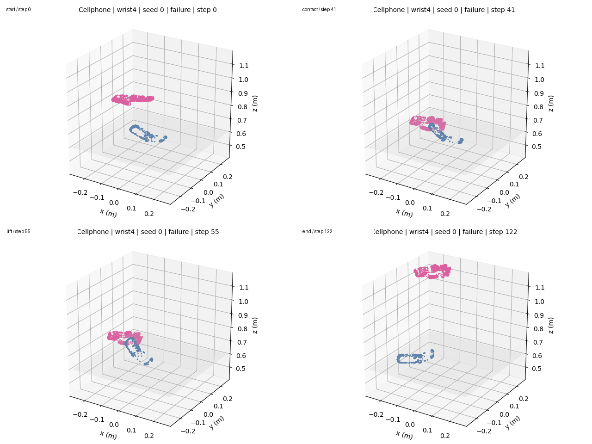

# 灵巧手三物体抓取实验报告

## 1. 执行路线与公平协议

本实验使用 GraspM3 的 Jar、Cellphone、USB stick，各自训练单物体策略。数据按完整 sequence 固定 80/20 划分（split seed=0），训练 seed 为 0/1/2；batch size 256，学习率 `2e-4`，最多 200 epoch、validation patience 30，以最低 validation loss checkpoint 评估。Baseline 使用官方兼容 MLP 与 `2×wrist + orientation + finger + L1`；唯一改进是把 wrist 权重由 2 改为 4。

RTX 5070 Ti 的 compute capability 为 sm_120。官方环境固定的 PyTorch 1.12.1+cu113 只包含至 sm_86 的 CUDA kernel，因此策略张量不能在这张卡上执行；这不是“整张 GPU 不可用”。本实验采用兼容分层路线：训练由 PyTorch 2.7.1+cu128 在 RTX 5070 Ti 上完成；checkpoint 经旧 PyTorch 严格加载；物理评估使用 GPU PhysX（`sim_device=cuda:0`、CPU pipeline），策略推理放在 CPU。

## 2. 最终结果

| 物体 | Baseline（3 seeds） | Wrist=4（3 seeds） |
|---|---:|---:|
| Jar | 19/60，31.67% ± 27.54% | 21/60，35.00% ± 30.41% |
| Cellphone | 9/60，15.00% ± 5.00% | 19/60，31.67% ± 2.89% |
| USB stick | 11/60，18.33% ± 7.64% | 2/60，3.33% ± 2.89% |
| Aggregate | 39/180，21.67% | 42/180，23.33% |

三 seed 误差为样本标准差。wrist=4 相对 baseline 带来正向提升，最终策略选择 **wrist-weighted（wrist=4）**。公平实验的最佳 aggregate 达到前期联合模型参考值 11/60（18.33%）；二者训练协议不同，前期数字仅作参考。Cellphone 单次 best run 最高为 7/20，说明 wrist 加权缓解了前期 wrist/姿态泛化瓶颈，但失败回放表明方向敏感问题仍未消失。代价是 USB 从 18.33% 降到 3.33%，成为最终策略的主要短板。

## 3. 曲线与真实回放证据

“checkpoint evaluation normalized lift score”定义为 `clip(max_lift_m / 0.30, 0, 1)`，用于补充闭环成功率，**不是 BC training reward**。每个成功率数字均可追溯至 `results/trajectory_metrics.csv` 和原始 `rollout_metrics.json` 汇总。

### 成功案例：Jar

### 失败案例：Cellphone

所有案例均由真实 rollout 的手部 28 维状态、物体 7 维位姿和官方几何模型重建，使用相同相机、坐标范围、帧率与颜色；`renders/` 同时提供 GIF、MP4、四帧 PNG 和 metrics JSON。

## 4. 结论边界与下一步

本实验只验证了固定三物体、固定 20 条 raw trajectory 和两个 wrist 权重，不能外推到未见物体或真实机器人。下一步优先对 Cellphone 做 wrist 姿态分层诊断，同时检查 USB 对 wrist 权重的负迁移，并在不破坏公平协议的前提下扩大 sequence 与独立测试对象；本阶段不继续无边界调参。
