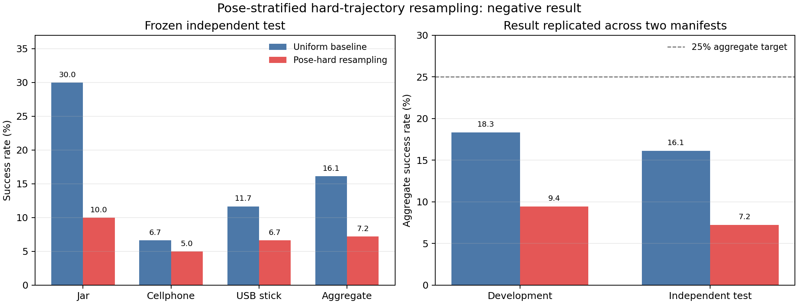

# 姿态分层困难轨迹重采样：独立负结果

这是“最终交付”之后单独开展的一轮性能优化，**没有修改原最终报告、图表、GIF 或结论**。本轮只改变训练采样概率，网络、完整 sequence 80/20 划分、wrist 权重 2、三个训练 seed、batch size、学习率、epoch 上限和 early stopping 预算均与公平 Baseline 一致。

## 结论

该方法未达到目标，应作为负结果保留，不替换当前最终策略。

| 独立 test | 公平 Baseline | 姿态困难重采样 | 差值 |
|---|---:|---:|---:|
| Jar | 18/60，30.00% | 6/60，10.00% | -20.00 pp |
| Cellphone | 4/60，6.67% | 3/60，5.00% | -1.67 pp |
| USB stick | 7/60，11.67% | 4/60，6.67% | -5.00 pp |
| Aggregate | **29/180，16.11%** | **13/180，7.22%** | **-8.89 pp** |

按“物体×trajectory”聚类、每簇固定平均三个训练 seed 的 20,000 次 bootstrap，test 成功率差值 95% 区间为 **[-15.56, -2.78] 个百分点**，完全低于 0。normalized lift 从 0.1700 降到 0.0910，差值 95% 区间为 [-0.1445, -0.0181]。因此退化不只是单次随机波动。

## 实验怎么做的

1. 新建 development 扰动清单，seed=`20260721`，SHA256=`f85068a480d0040fb1654238a272c63e138def44727c1a1884abdec900db8b05`。
2. 用现有三个 Baseline seed 在 development 上回放，以逐轨迹三 seed 失败率定义困难度。
3. 从 DexRep cache 的 `obj_rotmat` 读取初始物体姿态，以 15° 旋转距离阈值形成姿态层。
4. sequence 权重等于“姿态层逆频率 × (1 + development 失败率)”，均值归一化为 1，最大权重限制为 3。
5. 每个 epoch 仍抽取与 Baseline 相同数量的帧；验证集保持均匀且不参与权重计算。
6. development 评估后不再调参，才生成全新 test 清单。test seed=`20260722`，SHA256=`aca36ca6f0656d2e39c95a3a4f756466d151a36c377f1d31b243e6543813e315`，只评估一次。
7. 历史 Holdout SHA256 仍为 `8cec9bee7170c47782b8d6e19662f5698840b9958ed06449350c89fc788c020d`，本轮未读取或修改它。

三个原 split hash 全部保持不变。9 个新 checkpoint 均被官方旧 PyTorch 1.12.1 严格加载并完成 Isaac Gym GPU PhysX 回放。

## 为什么失败

Cellphone 只有 10 条训练 sequence，训练集内姿态层仅 3 个；其中稀有姿态 sequence 的最大权重达到 3。加权后 Cellphone validation loss 明显升高，说明模型为了拟合少数稀有/失败轨迹，破坏了主分布动作拟合。Jar 和 USB 也出现相同方向的闭环退化。

这说明“困难样本应该多看”这个假设过于粗糙：失败既可能来自数据稀缺，也可能来自互相冲突或无法由当前观测预测的动作模式。直接使用 replacement 过采样会重复整条 70 帧轨迹，并不等价于增加新的姿态信息。

## 文件

- `01_独立实验结果图.png/svg`：development 与 test 对比图；
- `02–05`：可用 Excel 打开的结果表和含配对统计的完整 JSON；
- `06_姿态困难采样清单.json`：每条训练 sequence 的姿态层、困难度和最终权重；
- `07–08`：冻结的 development/test 扰动清单；
- `09_实验配置.yaml`：训练预算、哈希、判定目标与最终状态。

复现代码位于仓库 `scripts/`。checkpoint、数据集、meshdata、Isaac Gym 和本机路径未上传。
