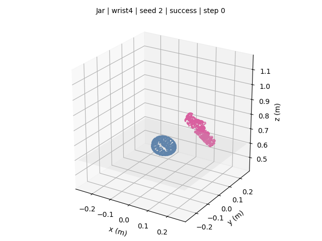
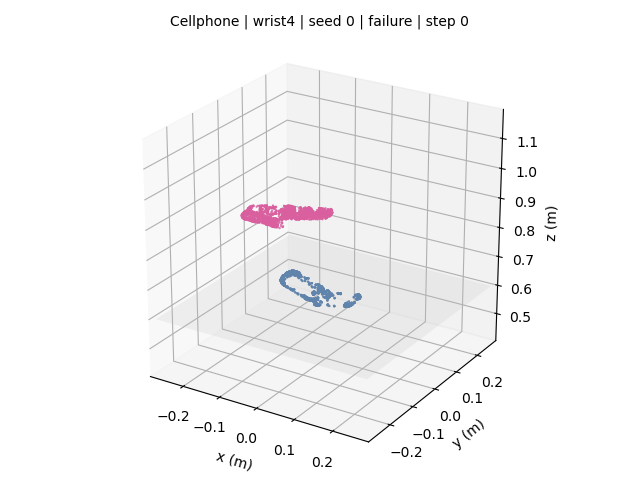

# 最终交付：从这里开始看

这个文件夹已经把实验结果整理成一个**扁平、中文、按编号排列**的交付包。你不需要进入 `scripts/`、`patches/` 或 `experiment-final/`。

## 如果时间有限，只看这三个文件

1. [实验总报告 PDF](01_灵巧手抓取实验总报告.pdf)
2. [三物体成功率结果图](05_核心结果图_三物体成功率.png)
3. 下方的成功与失败 GIF

## 最重要的实验结果

| 方法 | 总成功率 |
|---|---:|
| 公平 Baseline（wrist=2） | 39/180，21.67% |
| Wrist 加权（wrist=4） | **42/180，23.33%** |
| 独立扰动下三个成员均值 | 32/180，17.78% |
| 独立扰动下三模型集成 | 12/60，20.00% |

独立扰动测试表明，三模型集成可以降低最坏训练 seed 的风险，但没有统计显著地超过最佳单模型。完整边界见 [独立扰动泛化验证说明](04_独立扰动泛化验证说明.md)。

## 直接看回放

| Jar 成功 | Cellphone 失败 | USB 成功 |
|---|---|---|
|  |  |  |

## 直接看结果图

### 公平实验三物体成功率

### 独立扰动泛化结果

## 文件清单

| 编号 | 文件 | 用途 |
|---:|---|---|
| 01 | [灵巧手抓取实验总报告.pdf](01_灵巧手抓取实验总报告.pdf) | 最终提交给老师的两页报告 |
| 02 | [灵巧手抓取实验总报告.md](02_灵巧手抓取实验总报告.md) | 报告可编辑版本 |
| 03 | [自适应集成优化说明.md](03_自适应集成优化说明.md) | 三 seed 动作集成实验 |
| 04 | [独立扰动泛化验证说明.md](04_独立扰动泛化验证说明.md) | 位姿、摩擦、质量扰动测试 |
| 05–06 | 两张 PNG | 核心结果图和泛化结果图 |
| 07–09 | 三张 GIF | 成功与失败真实物理回放 |
| 10–11 | 两张 CSV | 可直接用 Excel 打开的结果总表 |
| 12 | [完整实验结果.json](12_完整实验结果.json) | 机器可读完整结果 |
| 13–14 | YAML/JSON | 公平实验与独立扰动复现配置 |

## 为什么策略没有直接使用 RTX 5070 Ti

RTX 5070 Ti 是 `sm_120`，官方旧环境的 PyTorch 1.12.1+cu113 只包含到 `sm_86` 的 CUDA kernel，因此旧环境中的策略推理放在 CPU。GPU 并非完全没用：训练由现代 PyTorch 在 RTX 5070 Ti 上完成，Isaac Gym 物理仿真也使用 GPU PhysX。

更完整的逐轨迹数据、SVG、MP4 和复现脚本仍保存在 [完整实验归档](../experiment-final/)；一般查看和提交只需要当前文件夹。
